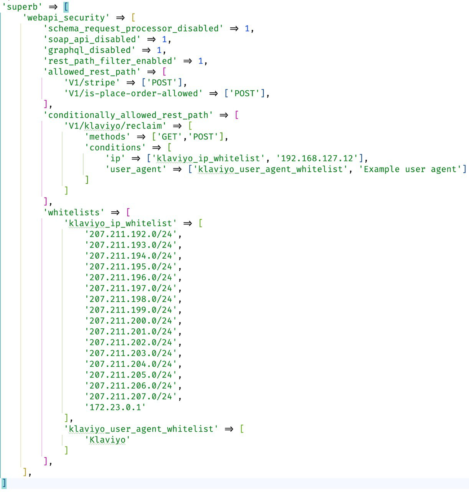

app/etc/env.php usage

1. `superb/webapi_security/schema_request_processor_disabled` - disable schema generate
2. `superb/webapi_security/soap_api_disabled` - disable SOAP API
3. `superb/webapi_security/graphql_disabled` - disable GraphQL API
4. `superb/webapi_security/rest_path_filter_enabled` - enable REST API path filter
5. `superb/webapi_security/allowed_rest_path` - list of allowed paths
6. `superb/webapi_security/conditionally_allowed_rest_path` - list of allowed path based on IP or User Agent
7. `superb/webapi_security/whitelists` - IP or User Agent lists

Full example below:

